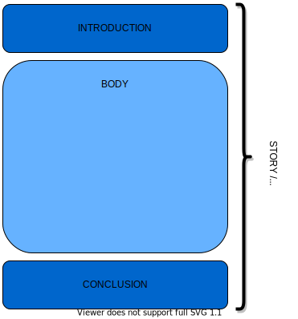

# WRITING A GOOD TEXT

No matter what you are writing about, no matter how long the text and no matter for which readers, there are some rules that **always** must be followed. Of these, the king of rules is **STRUCTURE**. This text will mainly look at structure and what it requires from you when you write. 

A lot of what is said here is phenomenally simple, but shouldn't be underestimated because they are very powerful! It is what I have come to call the *Frank-Immelman method* [^1]. Structure will make a text readable and if it is well done, then the chances are high that you have written a good text.

## Basic Structure

The basic structure can be summarised in three words: **INTRODUCTION, BODY, CONCLUSION**. Any readable text fits more or less [^2] into this structure. This structure can be seen as the skeleton that is carrying your text.

These three pieces each have their own tasks to fulfil and structure, but they are all **connected**. The connection is the **STORY or ARGUMENT** you are trying to tell or present. In other words, all these pieces will support you in telling your story and we will look at each of these individually. But first, we will look at the part that connects all the pieces; **your story**.

### Your story

Your story or your argument is what a text is all about. It's the meat on your structural skeleton. So you need to know 

* what you  are trying to bring across
* what the scope and setting of your story is
* who is the reader yu are trying to bring it across to

Once you have made these decisions, you can start building the skeleton. Most of your story is contained in the body, but we will look at these pieces individually next.

### Introduction

The function of an introduction is to let the reader know what the text contains. Put more simply, after having read the introduction the reader should know

* what the text is about,
* what they can expect when they read the rest of the text,
* if they want to continue reading the rest of the text.

Thus, the introduction should awaken your targeted readers interest in reading on. It's helpful to already capture them with the first sentence.

Contrary to what one may expect, the introduction is usually the thing that you will complete writing at the end of your writing process. It sounds less strange when you think of the introduction as the piece that tells the reader what to expect. You yourself will only know that once all the pieces are complete.

### Body

This is where you tell your story and make your arguments. There are numerous different ways of structuring a body and these will not be discussed here. Instead a few general principles will be touched upon.

When writing it, put yourself in the shoes of the reader. The text should take them on a trip through your story line or your argument. Whether they agree or disagree, like it or don't like it doesn't matter. What does matter is that they can follow your story or argument relatively easily.

We have mentioned that it is important to decide on your target audience early. Let's look at it from your perspective. If you read a text that makes you feel insulted because it feels like the author assumes you know none of that which is being discussed, you are probably not a member of the target audience. If a text appears structured, yet too difficult to understand, you are again probably not part of the target audience that the writer was writing for. 

In the body of a text you will have substructures like sections or parts. These will all be built with an element called the **paragraph**. And yes, of course, a paragraph has a structure:
* One sentence is not a paragraph. In an English text a sentence on it's own will look like a lonely floating entity (in other languages, like German, this may not be the case).
* A paragraph is a container for a small idea or concept which is introduced at the beginning of the paragraph (mostly implicitly). 

### Conclusion

The conclusion summarises everything contained in the body that was promised in the introduction. It never new introduces ideas or issues that were not dealt with in the text it is concluding. 

## The process

Writing a text is a process and in this process there will be a lot of back and forth, much changing and deleting and replacing. Electronic media has made this a lot easier. Take advantage of this. You may even feel the need at some points to give the entire text a new structure, but always make sure that you have a structure. And when you make smaller changes, make sure they don't topple your structure.

## Tips

* try to draw your article in a diagram on a piece of paper to visualise it and check whether 
  * the structure is actually what you want and whether it fits into the basic structure of **introduction, body and conclusion**
  * you have taken some deviations that do not help in telling the story, even if it very difficult to admit that something isn't really needed here.
* reread your article/story/section/paper a little while after you have written it. Later depends on how much time you have left: a few hours, a few days. You will notice things you didn't notice before. This is because when we are writing there are many things in our heads that add information and structure to what you have written down, but are often actually missing in the text.
* find someone who fits approximately into the group of people in your target audience and then ask them questions about what they understood and how they understood it
* (personally, I fnd this to be one of the hardest parts) **start writing!**. If you have perfectionist tendencies, you may think that you need to know everything before you start. But in fact, writing helps you to discover what you need more easily and helps you to strucutre things with the **huge bonus** of actually being able to see progress in your work
* you can *always* improve a text, but at some point you need to stop. To stop is a *decision* and not an easy one. If a decision doesn't make the decision for you, you have to make it all on your own and that is not easy. But convince yourself that *good enough* is in fact enough.
* when reading texts authored by others, look at the structures they use, why and how. This will help you to learn for your own writing.

**author: Sarah Thandi DIPPENAAR**

PS: this text doesn't feel finished at all, but with this sentence I have decided that I have finished. I know I can always come back to improve it and perhaps I will. But for now it it is finished.

 [^1]: my history and English teachers respectively from high-school from whom I learned most of what I know about writing
 [^2]: *more or less* because certain structures, like the French dissertation have extra pieces such as the *ouverture*.
